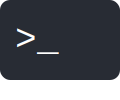

<h1 align="center">Hi 👋, I'm Ahmed Al-dhayani</h1>
<h3 align="center">A passionate backend developer from Yemen</h3>

  

  

  

<h3 align="left">Connect with me:</h3>

<h3 align="left">Languages and Tools:</h3>

 
 
 
 
 
 

 
 
 
 
 
 
 
 

&nbsp;

