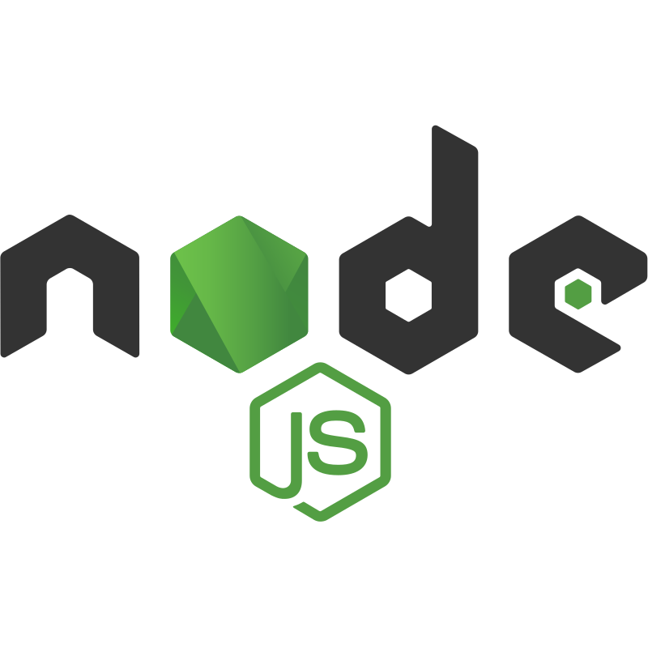
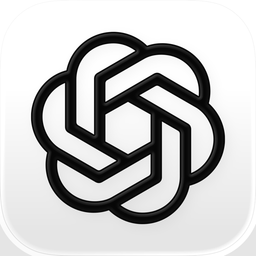
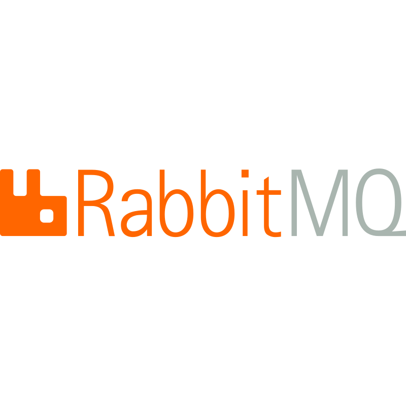
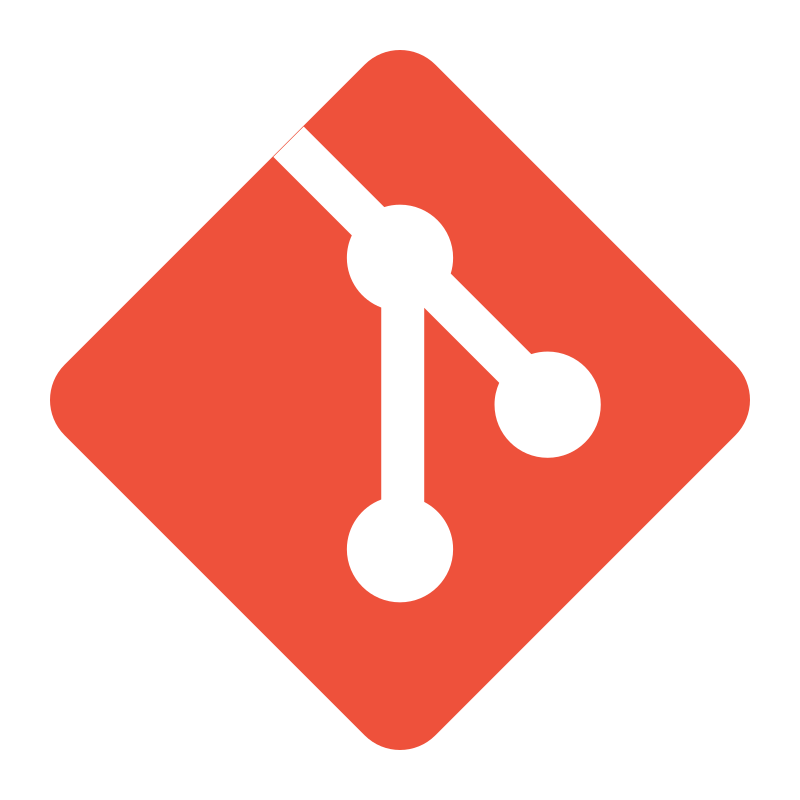

<h1 align="center">Hi 👋, I'm Ahmed Nabil Al-Dhayani</h1>
<h3 align="center">Full Stack Developer | Node.js, NestJS, React, Next.js | n8n Automation Engineer</h3>

  

  

---

## 🚀 About Me

- 💼 Full Stack Developer specializing in scalable web applications and distributed systems
- 🤖 Experienced in building advanced workflow automations using **n8n**
- 🌍 Based in **Sana'a, Yemen**
- 🔥 Passionate about backend architecture, frontend performance, and AI-powered automation
- 🏗️ Building modern applications with **Node.js, NestJS, React, and Next.js**
- ⚡ Strong expertise in microservices, event-driven systems, and API design
- 📫 Reach me at **bplahmed28@gmail.com**

---

## 🌐 Connect With Me

  
  

---

## 🛠️ Tech Stack

### Backend

  
  
  
  

### Frontend

  
  
  
  

### Automation & AI

  
  

### Databases & Messaging

  
  
  
  
  

### DevOps & Tools

  
  
  
  

---

## 💼 Professional Experience

- 🏢 Full Stack Developer at **Bina Center**
- ⚙️ Backend Developer at **ClubApp**
- 🏗️ Backend Developer at **Siolla**
- 🔐 Backend Developer at **Deepsafer**
- 🤖 Automation Engineer with **n8n** and AI integrations

---

## 📊 GitHub Stats

  

  

  

---

## 🐍 Contribution Snake

  

---

## 🎯 Current Focus

- Building scalable SaaS platforms
- n8n workflow automation and AI agents
- Microservices and distributed systems
- High-performance Next.js applications
- DevOps and cloud-native architectures

---
